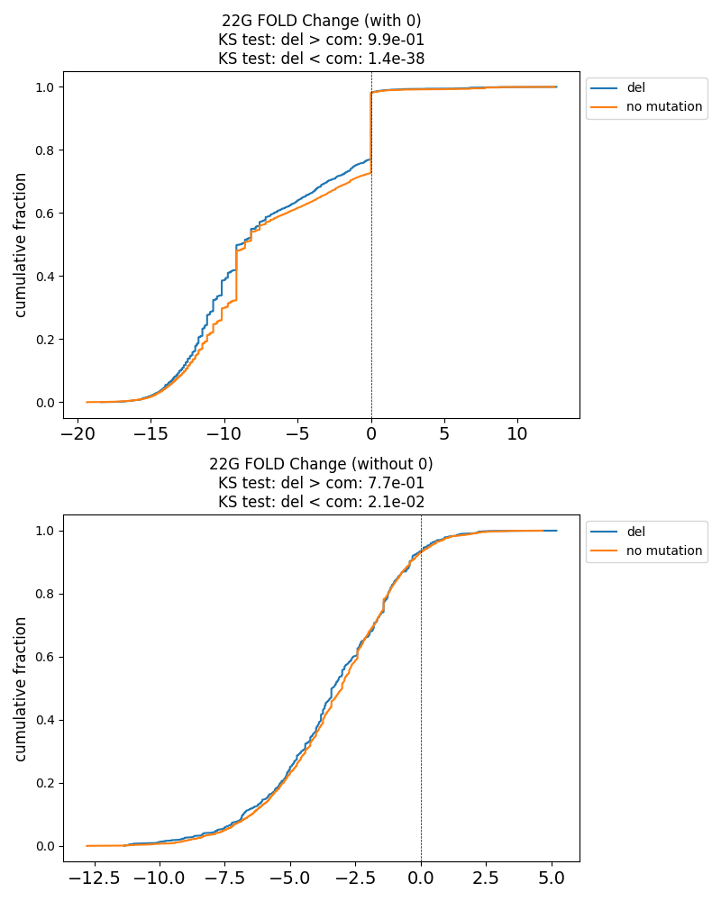

# Generate paper figures

## Before Analysis
To get started, clone the repository and install the required dependencies:

```bash
git clone https://github.com/lu1215/MutaCLASH.git
cd MutaCLASH/generate_paper_figures
pip install -r requirements.txt
```

## PRG-1 CLASH Data Processing
1. **[Download the PRG-1.csv file](http://nas.csblab.ee.ncku.edu.tw:32200/sharing/iXKXJG1yb)** and place it in the following directory:
   ```
   MutaCLASH/generate_paper_figures/input
   ```
2. Run the processing script:
   ```bash
   sh run_additional.sh --input PRG-1
   ```
3. The output will be saved in:
   ```
   MutaCLASH/generate_paper_figures/output/PRG-1_<date_time>/
   ```
   This folder contains:
   - CSV file:
     - Contains results with all information fields.
   - A `figure` folder containing:
     - Four subfolders: `abu_plot`, `distribution_plot`, `G22_plot`, and `pairing_ratio_plot`.
     - A score plot.
   
   For a detailed explanation of each output file and figure, refer to the page below.
---

## ALG-1 CLASH Data Processing
1. **[Download the ALG-1.csv file](http://nas.csblab.ee.ncku.edu.tw:32200/sharing/iXKXJG1yb)** and place it in:
   ```
   MutaCLASH/generate_paper_figures/input
   ```
2. Execute the following command:
   ```bash
   sh run_additional.sh --input ALG-1
   ```
3. The results will be saved in:
   ```
   MutaCLASH/generate_paper_figures/output/ALG-1_<date_time>/
   ```
   This folder contains:
   - CSV file:
     - Contains results with all information fields.
   - A `figure` directory, which includes:
     - Subdirectories: `abu_plot`, `distribution_plot`, `G22_plot`, and `pairing_ratio_plot`.
     - A score plot.

   For a detailed explanation of each output file and figure, refer to the page below.


## run_additional.sh
```bash
sh run_additional.sh --input <PRG-1 or ALG-1>
```
**required arguments:**
- **input**: PRG-1 or ALG-1.

<!-- See https://github.com/lu1215/MutaCLASH/tree/master/examples/paper%20data for an example. -->

run_additional.sh is used to regenerate figures on paper; the user must first place ALG-1.csv and PRG-1.csv in the data/input folder before running this program.

[Reference metadata files and output files](http://nas.csblab.ee.ncku.edu.tw:32200/sharing/jSirL0jvo)

<!-- After executing the command, the pipeline will run and complete all the necessary steps. Please refer to the [examples](https://github.com/lu1215/MutaCLASH/tree/master/examples) we provided. -->


## Output
The output files are stored in the `output/` directory. The directory contains the following files:
- **CSV file**: Contains results with all information fields.
- **Figures:** The final generated figures are stored in the `figure/` subdirectory.
- **Logs**: Records commands, and summarizes the quantity, proportion, and distribution of various mutations, which are stored in the `log/` subdirectory.
- **Intermediate Files:** The intermediate files generated during the analysis are stored in various formats (.csv, etc.) and can be found in their respective tool directories.

### Figures
The output figures generated by the MutaCLASH pipeline include:

- **Score Distribution:** Presents the quantity and trend of different scores.


- **Mutation Distribution:** Provides information on the distribution of mutations, including deletions and substitutions.


- **Pairing Ratio:** Calculates and analyzes the pairing ratios at both global and individual coordinates.  
In statistical testing, ** and * indicate significant differences, with U-test P<0.05 and 0.10, respectively.


- **Abundance Analysis:** Performs abundance analysis, comparing wild-type samples and fold-change measurements.
<!--img src="examples/fig/22G.png" width=300 /-->


- **Cumulative Distribution Function (CDF):** Calculates and visualizes the cumulative distribution function.
<!--img src="examples/fig/22G_CDF.png" width=300 /-->


<!--Please refer to the corresponding tool documentation for more details on the specific output files and their interpretations.-->